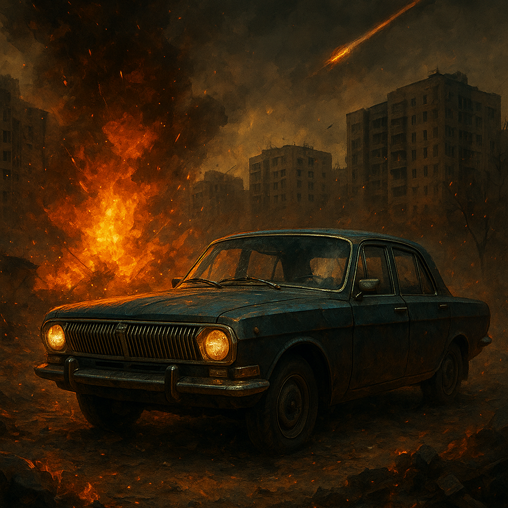

# Chinazes: Escape From Fryazino

**Город горит. Дороги перекрыты. Пути назад нет.**
Садитесь за руль бронированного внедорожника, поднимите напарника к пулемёту на крыше и прорывайтесь сквозь руины советского города, пока погоня не превратила вас в груду металлолома.

---

## Об игре

*Chinazes: Escape From Fryazino* — аркадный боевик на колёсах о побеге из охваченного войной города. Над панельками висит пепел, где-то вдали воет сирена воздушной тревоги, а по пустым проспектам за вами идут машины с турелями, гранатомётчики на «буханках» и многотонный Урал-таран.

Играйте **в одиночку** — сами ведите машину и сами стреляйте — или **вдвоём по локальной сети**: один за рулём, второй у пулемёта. Для полного погружения игра поддерживает **VR-шлем**, **руль Logitech G29**, **мехатронные платформы** и **тактильный жилет**: каждый удар, вираж и попадание вы почувствуете телом.

## Особенности

### 🚗 Погоня, в которой важна каждая секунда
- Тяжёлый внедорожник с настоящей физикой: подвеска, занос, нитро, пробуксовка с дымом из-под колёс и следами шин на асфальте.
- Механическая коробка передач со сцеплением для руля — или автомат для одиночной игры.
- Перевернулись или угодили в овраг? Удерживайте **R**, и машина снова на дороге. Погоня не ждёт.

### 🔥 Пулемёт на крыше
- Поворотная турель на люке: очереди трассерами, искры и пыль в местах попаданий, маркер попадания по врагу.
- Пулемёт перегревается: держите ритм и не дайте стволу раскалиться в самый неподходящий момент.

### 💀 Враги, которые не дают расслабиться
- Волны преследователей нарастают: машин всё больше, они крепче и стреляют больнее.
- **Седаны с турелями** таранят вас бортом на полном ходу.
- **УАЗ-«буханка»** с гранатомётчиком в окне — граната летит с упреждением, но от неё можно уйти рывком.
- **Урал-таран** весом в шесть тонн разгоняется и бьёт прямо в вас.
- **Босс** каждую пятую волну — тёмно-красная машина с усиленным пулемётом.
- Со второй волны враги поджидают в засадах: во дворах, у гаражей, в частном секторе.

### 💥 Всё ломается
- Кузова мнутся от ударов, а от сильных столкновений отлетают бамперы, решётки и панели.
- Повреждённая машина дымит, перед гибелью горит и взрывается.
- Конусы, бочки и заграждения разлетаются от машин и пуль; горящие бочки взрываются и поджигают соседние по цепочке — заманите врагов поближе.
- Ремкомплекты на дорогах подлатают машину на ходу.

### 🏙️ Мёртвый советский город
- Дворы с панельками, хоккейными коробками и лавочками, промзона, частный сектор с деревянными домами и огородами, гаражный кооператив, опоры ЛЭП, остановки с ларьками и блокпост.
- Сгоревшие остовы машин, баррикады, пепел в воздухе и туман у земли.
- Далёкие перестрелки, взрывы и сирена со всех сторон — фон войны, который не стихает ни на минуту.

### 🎖️ Очки и рекорды
- Очки за каждого врага и за выживание, множитель комбо за убийства подряд.
- Экран гибели с итогом заезда и вашим лучшим результатом.

### 🎮 Играйте как удобно
- **Одиночная игра** на мониторе: вид от третьего лица, водитель и стрелок в одном лице.
- **Кооператив на двоих** по локальной сети — без интернета и аккаунтов.
- **VR** (Meta Quest 2 и другие шлемы с OpenXR), **руль Logitech G29**, **платформы 2DOF и FutuRift**, **bHaptics**.
- Главное меню — командный пункт в бункере с экранами военного терминала.
- Гибкие настройки графики: пресеты от «Низкого» до «Ультра» и ручная настройка каждого параметра.

## Управление (одиночная игра)

| Клавиша | Действие |
|---|---|
| `W` / `S` | газ / тормоз и задний ход |
| `A` / `D` | руль |
| левый `Shift` | нитро |
| мышь | обзор и прицел |
| ЛКМ | огонь |
| `L` | мигалка |
| `R` (удерживать) | поставить машину на колёса |
| `Esc` | пауза |

В кооперативе водитель управляет с руля G29 или клавиатуры, стрелок — мышью или VR-контроллерами.

## Как начать

1. Распакуйте архив в любую папку.
2. Запустите `Chinazes Escape From Fryazino.exe`.
3. В меню выберите **«Одиночная игра»** — или **«Создать игру»** на одном ПК и **«Найти игру»** на другом, чтобы играть вдвоём (оба ПК в одной сети).

Без подключённого VR-шлема игра запускается на мониторе.

## Системные требования

- **ОС:** Windows 10 / 11 (64-bit)
- **Место на диске:** около 700 МБ
- **Сеть:** локальная сеть — только для игры вдвоём
- **Дополнительно (необязательно):** VR-шлем с OpenXR, руль Logitech G29, платформы 2DOF / FutuRift, устройства bHaptics

Игра проверялась на ноутбуке с Intel Core i7-13700H и встроенной графикой Intel Iris Xe.

---

*Игра создана в рамках курсовой работы «Разработка VR-игры с использованием мехатронных устройств».*
Документация для разработчиков — в [DEVELOPMENT.md](DEVELOPMENT.md).
